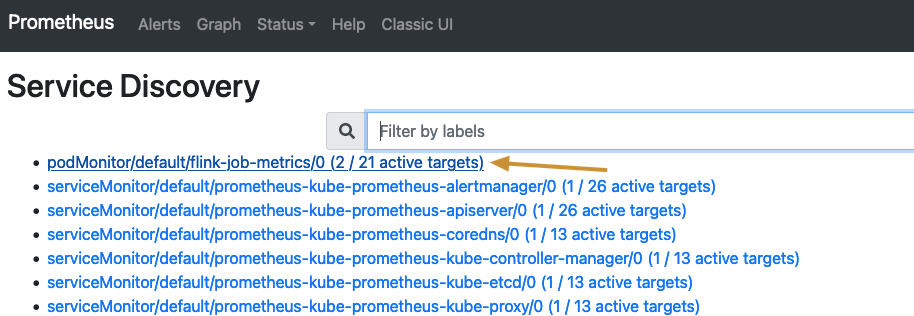
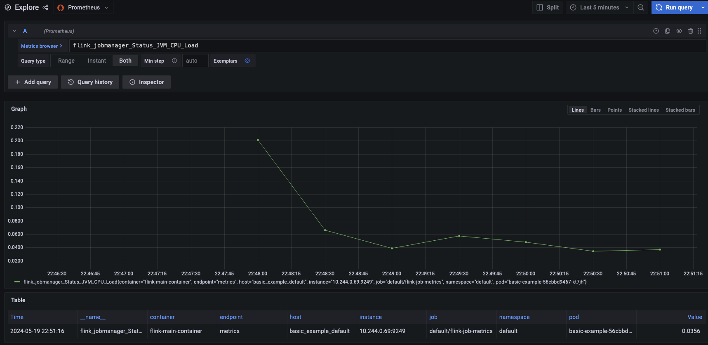

The doc shows how to collect and display metrics of flink jobs launched by flink k8s operator using Prometheus.
## Install Prometheus Operator
```shell
helm repo add prometheus-community https://prometheus-community.github.io/helm-charts
helm install prometheus prometheus-community/kube-prometheus-stack
```
Output:
```txt
NAME: prometheus
LAST DEPLOYED: Sun May 19 22:41:42 2024
NAMESPACE: default
STATUS: deployed
REVISION: 1
NOTES:
kube-prometheus-stack has been installed. Check its status by running:
  kubectl --namespace default get pods -l "release=prometheus"

Visit https://github.com/prometheus-operator/kube-prometheus for instructions on how to create & configure Alertmanager and Prometheus instances using the Operator.
```

## Start Flink job and check the metrics
```shell
# Start Flink job 
kubectl apply -f flink-k8s-operator-monitor/basic.yaml
# Check metrics output
kubectl exec -it basic-example-taskmanager-1-1 -- bash
# Then, in the pod:
curl 127.0.0.1:9249
```
Output:
```txt
# HELP flink_taskmanager_Status_JVM_GarbageCollector_Copy_Time Time (scope: taskmanager_Status_JVM_GarbageCollector_Copy)
# TYPE flink_taskmanager_Status_JVM_GarbageCollector_Copy_Time gauge
flink_taskmanager_Status_JVM_GarbageCollector_Copy_Time{host="10_244_0_74",tm_id="basic_example_taskmanager_1_1",} 24.0
...
```

## Start Pod Moinitor to monitor flink job pods
```shell
# Start Pod monitor
kubectl apply -f flink-k8s-operator-monitor/pod-monitor.yaml
```

## Check Prometheus WebUI
```shell
kubectl port-forward svc/prometheus-kube-prometheus-prometheus 9090
```
Then check `127.0.0.1:9090/service-discovery` to see if the flink-job-metrics PodMonitor works as expected.


## Configure Grafana
```shell
kubectl port-forward deployment/prometheus-grafana 3000
```
Then configure the `explore` page, you should be able to see metrics like this:


## Reference
- [Metrics and Logging | Apache Flink Kubernetes Operator](https://nightlies.apache.org/flink/flink-kubernetes-operator-docs-release-1.8/docs/operations/metrics-logging/#how-to-enable-prometheus-example)
- [servicemonitor not being discovered · Issue #1392 · prometheus-operator/kube-prometheus](https://github.com/prometheus-operator/kube-prometheus/issues/1392)