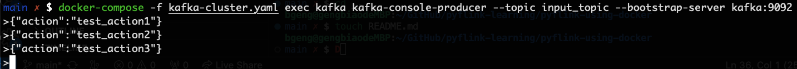
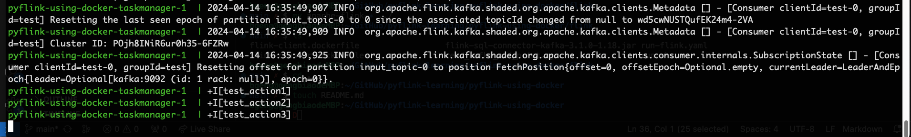

# Using PyFlink to read Kafka message in Docker

## Prepare Docker images
### Build PyFlink image
```bash
cd pyflink-using-docker
docker build --tag pyflink:latest -f ./flink-cluster.dockerfile .
```

### Build Flink client image
```bash
docker build --tag pyflink-client:latest -f ./flink-client.dockerfile .
```

## Start clusters
### Start Kafka cluster and create test topic
```bash
docker-compose -f ./kafka-cluster.yaml up -d
docker-compose -f kafka-cluster.yaml exec kafka kafka-topics --create --topic input_topic --partitions 1 --replication-factor 1 --if-not-exists --bootstrap-server kafka:9092
```

### Start Flink session cluster 
```bash
docker-compose -f ./flink-cluster.yaml up
```

### Write message into Kafka cluster
Please open a new terminal.
```bash
docker-compose -f kafka-cluster.yaml exec kafka kafka-console-producer --topic input_topic --bootstrap-server kafka:9092
```
Then in the terminal from the kafka cluster, input following json messages for test(after typing each line, remeber to type 'enter'):
```json
{"action":"test_action1"}
{"action":"test_action2"}
{"action":"test_action3"}
```


And then in the termial of flink cluster, you could the following output of each kafka record:

