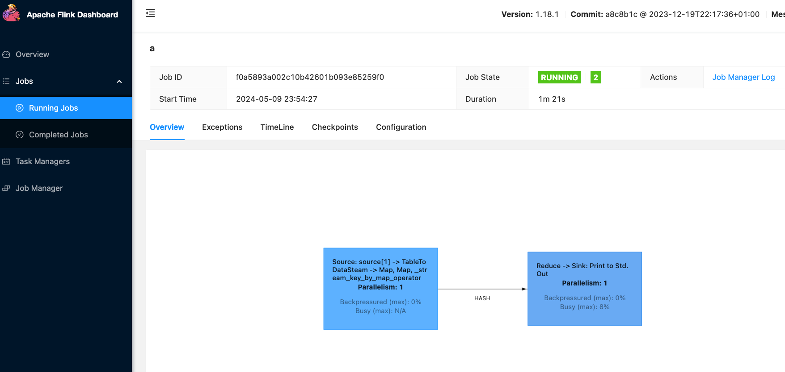

## Prepare for flink kubernetes operator using minikube
### Install and start minikube on Mac
```bash
brew install minikube
minikube start --base-image='gcr.io/k8s-minikube/kicbase:v0.0.43'
```
### Add flink kubernetes operator via helm chart
```bash
helm repo add flink-operator-repo https://downloads.apache.org/flink/flink-kubernetes-operator-1.8.0/
# Disable webhook to use less resource in the minikube cluster
helm install flink-kubernetes-operator flink-operator-repo/flink-kubernetes-operator --set webhook.create=false
```
See [quick-start](https://nightlies.apache.org/flink/flink-kubernetes-operator-docs-main/docs/try-flink-kubernetes-operator/quick-start/) for more details.

### Build pyflink docker image
```bash
eval $(minikube docker-env) && docker build --tag pyflink-image:latest -f ./pyflink-image.dockerfile . 
```

### Run the job
```bash
# Start
kubectl apply -f python-example.yaml

# Forward web ui port to localhost
kubectl delete flinkdeployment/python-example
 
# Stop
kubectl delete flinkdeployment/python-example 
```

